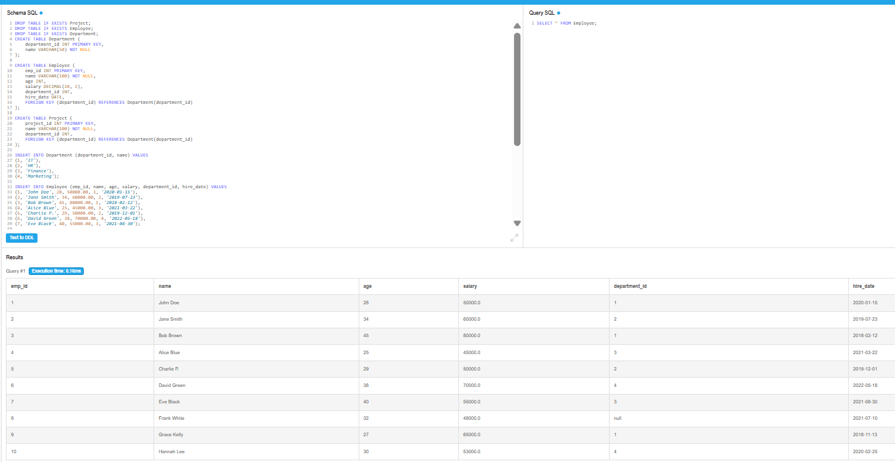
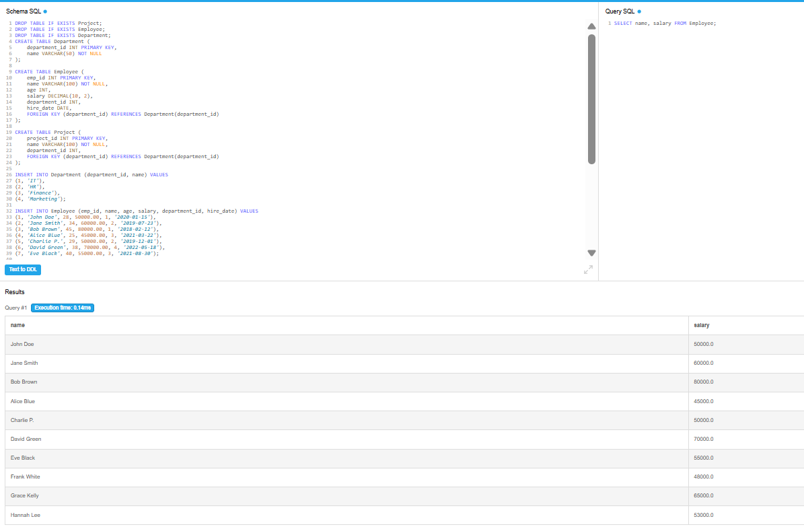
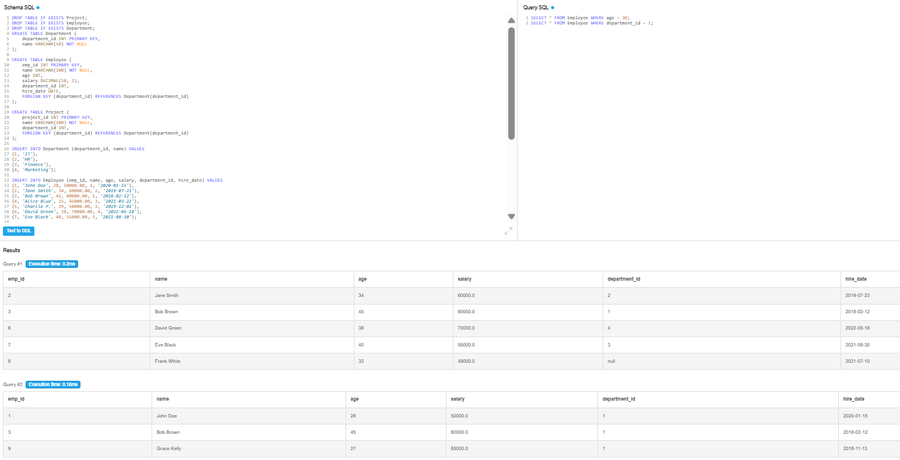
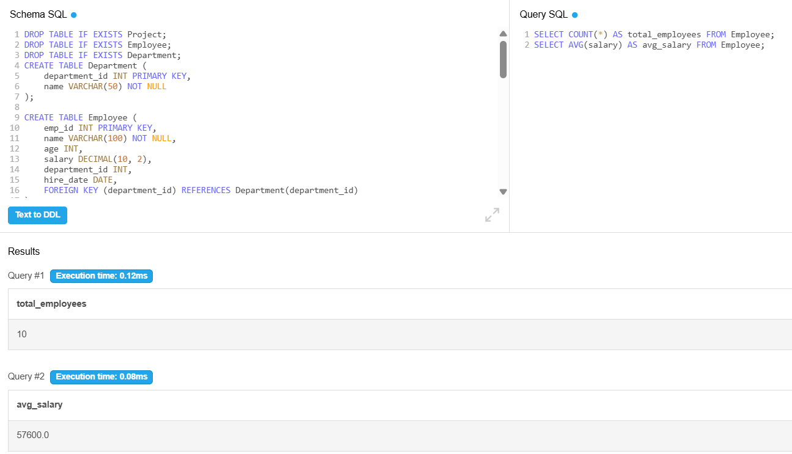
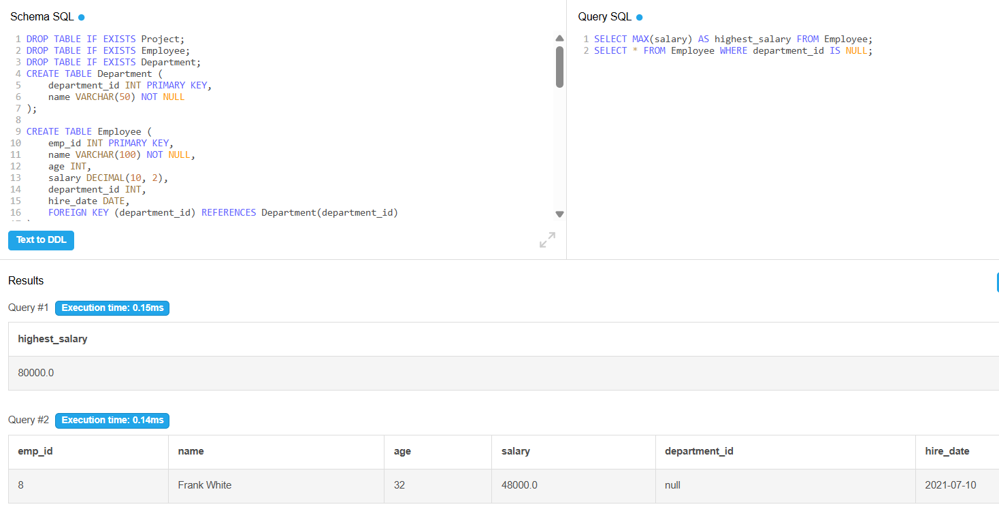
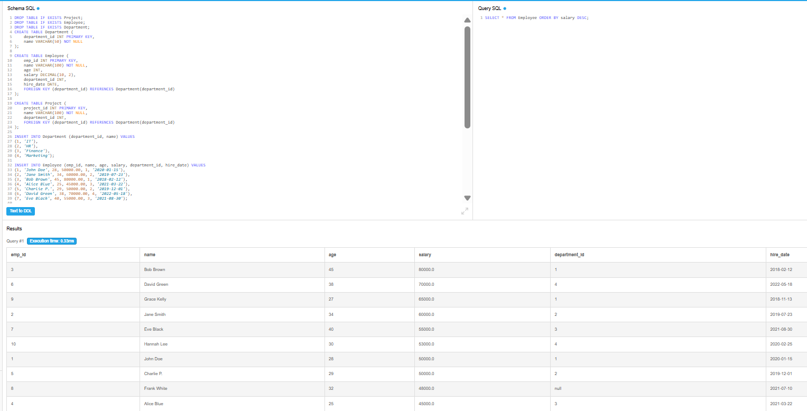
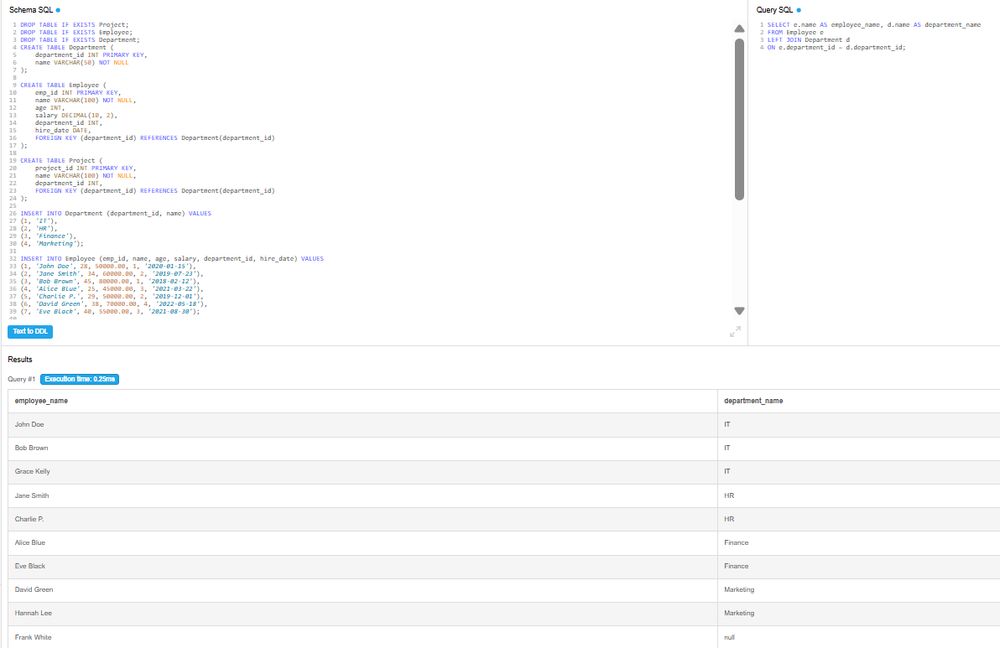
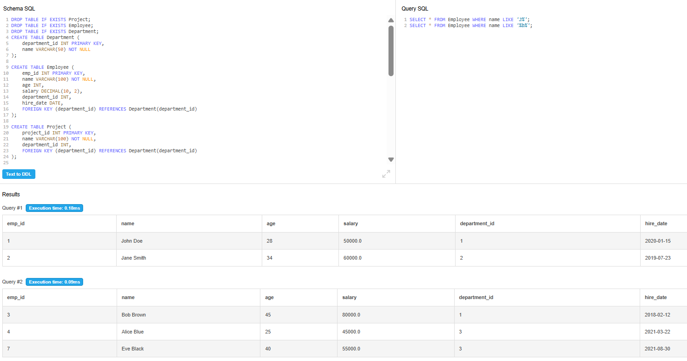
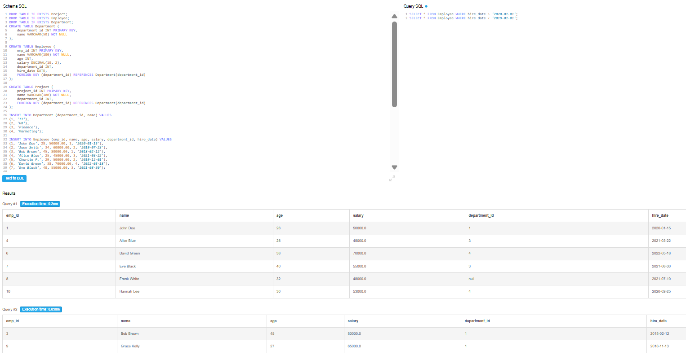

# Week 1 - Day 1

## 📌 Topics Covered
- Introduction to SQL
- Understanding database tables (Employee, Department, Project)
- Basic SQL queries (SELECT, WHERE, ORDER BY)
- Aggregate functions (COUNT, AVG, SUM, MAX)
- Joins (combining Employee and Department tables)

## 🧪 Practice Work
- Executed given `datacreation.sql` in DB Fiddle
- Created tables and inserted data
- Solved multiple SQL queries from practice document
- Tested queries and verified outputs

## 🧠 What I Learned
- How to create and manage tables using SQL
- Writing SELECT queries to retrieve data
- Filtering data using WHERE conditions
- Using aggregate functions like COUNT, AVG, SUM
- Sorting data using ORDER BY
- Performing joins between tables
- Handling NULL values in queries
- Understanding primary key and foreign key relationships

## 📂 Files Included
- `queries.sql` → Contains all questions and SQL solutions
- `output1.png`, `output2.png`, `output3.png` → Query outputs

## 📸 Output Screenshots

## 🔗 Practice Platform
- Used DB Fiddle to execute SQL queries
